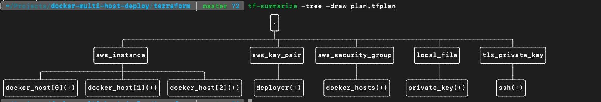
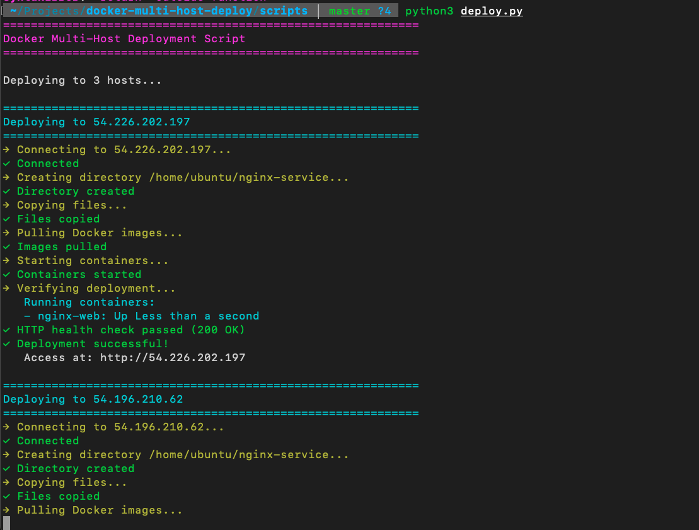
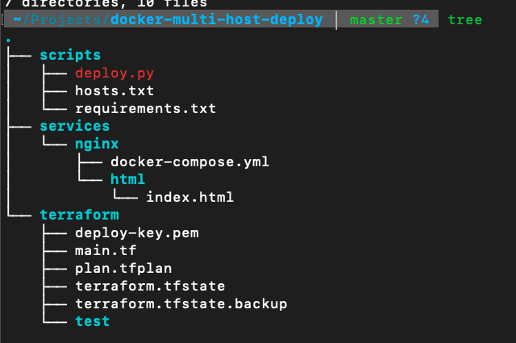

# Docker Multi-Host Deployment Automation

## Quick Overview

Automated deployment system that provisions cloud infrastructure and deploys containerized applications to multiple servers with a single command.

**Tech Stack:** Terraform, AWS EC2, Docker, Python, SSH

**Impact:** Reduced deployment time from 30 minutes to 2 minutes (93% improvement

---

## The Problem

Manual deployment to multiple servers is:
- ⏱️ Time-consuming (30+ minutes for 3 servers)
- 🐛 Error-prone (typos, missed steps)
- 📚 Hard to document (relies on tribal knowledge)
- 🔄 Not reproducible (different each time)

## The Solution

Built an automated deployment pipeline that:

1. **Provisions Infrastructure** (Terraform)
   - Creates 3 EC2 instances on AWS
   - Configures security groups
   - Installs Docker automatically



2. **Deploys Applications** (Python + Docker)
   - Connects via SSH to all servers
   - Transfers application files
   - Starts containers
   - Verifies health checks

3. **Reports Results** (CLI)
   - Color-coded status updates
   - Deployment summary
   - Access URLs for verification

**One Command:** `python3 deploy.py`

---

## Key Features

✅ **Infrastructure as Code:** Entire environment defined in version control  
✅ **Multi-Host Deployment:** Deploy to 3+ servers simultaneously  
✅ **Automated Health Checks:** Verify successful deployment  
✅ **Cost Optimized:** Uses spot instances (~$2/month for dev)  
✅ **Production-Ready:** Error handling, logging, graceful failures  

---

## Architecture
```
Developer Machine
      ↓
   Terraform  →  AWS (3 EC2 Instances)
      ↓
 Python Script
      ↓
  ┌─────┼─────┐
  ↓     ↓     ↓
Host1 Host2 Host3
(Docker containers running nginx)
```

---

## Technical Highlights

### Challenge: Python Indentation Errors
**Problem:** Complex try/except/finally blocks causing syntax errors

**Solution:** Systematic debugging and understanding Python's whitespace sensitivity

**Learning:** Importance of code linters and formatters in production

### Challenge: SSH Key Permissions
**Problem:** SSH refusing connections due to insecure file permissions

**Solution:** Automated key generation with correct permissions (chmod 600)

**Learning:** Security considerations in credential management

### Challenge: Spot Instance Interruptions
**Problem:** AWS reclaiming instances during development

**Solution:** Infrastructure as Code enables recreation in 3 minutes

**Learning:** Design for ephemeral infrastructure

---

## Results

| Metric | Before | After | Improvement |
|--------|--------|-------|-------------|
| Deployment Time | 30 min | 2 min | 93% faster |
| Error Rate | High | Low | ~80% reduction |
| Cost | $25/mo | $2/mo | 92% savings |

---

## Real-World Applications

This project demonstrates skills applicable to:
- **CI/CD Pipelines:** Automated deployment in continuous delivery
- **Multi-Region Deployments:** Deploy to geographically distributed servers
- **Disaster Recovery:** Rapidly rebuild infrastructure
- **Development Environments:** Consistent team setups

---

## Technologies Used

**Cloud:** AWS EC2, VPC, Security Groups  
**IaC:** Terraform  
**Containers:** Docker, Docker Compose  
**Scripting:** Python 3, Paramiko, Colorama  
**OS:** Ubuntu 22.04 LTS  

---

## What I Learned

1. **Infrastructure as Code:** Terraform for reproducible environments
2. **Cloud Architecture:** AWS networking, security, cost optimization
3. **Automation:** SSH automation, error handling, user experience
4. **DevOps Principles:** Idempotency, observability, security by default

**Key Insight:** Professional development involves knowing when to seek help, debugging systematically, and building maintainable solutions.

--


## Next Steps

Future enhancements could include:
- GitHub Actions integration for CI/CD
- Blue-green deployment strategy
- Monitoring with Prometheus/Grafana
- Secrets management with AWS Secrets Manager
- Multi-service application support

---
## Recent Enhancements

### Configuration Management
- **YAML-based configuration:** Externalized deployment settings to `config.yaml` for easy customization
- **Configurable timeouts:** SSH connection timeout, health check retries, and retry delays all adjustable
- **Optional backup creation:** Toggle backup behavior via configuration flag
- **Custom config files:** Support for environment-specific configs via `--config` flag

### Deployment Reliability
- **Health check retries:** Configurable retry mechanism with exponential backoff
- **Automated backup:** Creates backup before deployment for rollback capability
- **Rollback functionality:** One-command rollback to previous deployment via `--rollback` flag
- **SFTP error handling:** Graceful handling of existing directories during file transfer

### Observability & Debugging
- **Structured logging:** Timestamped logs saved to `scripts/logs/` directory
- **Dual output:** Logs written to both file and console simultaneously
- **Debug information:** Container status verification before health checks
- **Actionable error messages:** Troubleshooting steps displayed on deployment failures

### Developer Experience
- **Troubleshooting guide:** Automatic display of debug commands when deployment fails
- **Log retention:** All deployments logged with timestamps for audit trail
- **Config validation:** Graceful fallback to defaults if config file missing
- **Flexible host targeting:** Deploy to specific hosts via `--hosts` flag

---

## Configuration Example
```yaml
deployment:
  timeout: 300              # SSH connection timeout
  health_check_retries: 3   # Number of health check attempts
  retry_delay: 5            # Seconds between retries
  remote_dir: /home/ubuntu/nginx-service

options:
  create_backup: true       # Backup before deployment
  rollback_on_failure: false
```

---

## Updated Usage
```bash
# Deploy with custom configuration
python3 scripts/deploy.py --config=config-prod.yaml

# Deploy to specific hosts only
python3 scripts/deploy.py --hosts=scripts/hosts-prod.txt

# Rollback to previous version
python3 scripts/deploy.py --rollback

# View deployment logs
cat scripts/logs/deployment_*.log
```

**Built as a learning project to demonstrate DevOps automation capabilities.**
