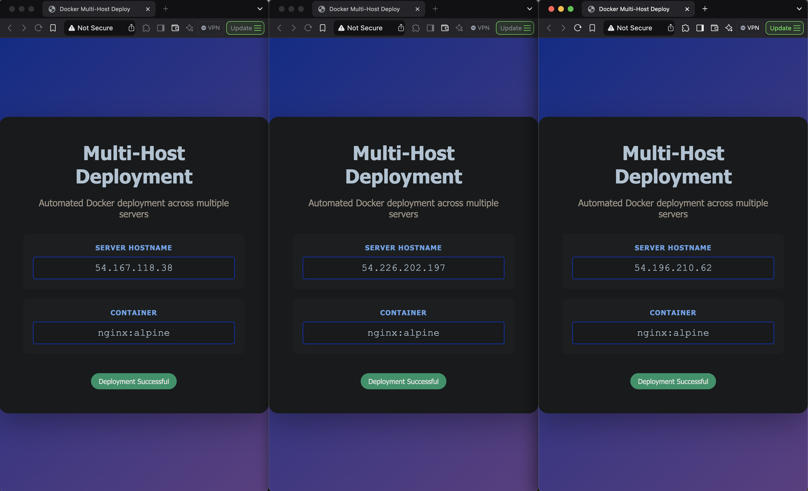

# Docker Multi-Host Deployment Automation

Automated deployment system for containerized applications across multiple cloud instances using Infrastructure as Code and Python scripting.



## 🎯 Project Overview

This project automates the deployment of Docker containers to multiple EC2 instances, demonstrating practical DevOps skills including infrastructure provisioning, configuration management, and deployment automation.

**Key Achievement:** Reduced deployment time from ~30 minutes (manual) to ~2 minutes (automated) across 3 servers.

## 🏗️ Architecture
```
┌─────────────────┐
│  Local Machine  │
│   (Control)     │
└────────┬────────┘
         │
         ├─── Terraform ───> AWS EC2 (Infrastructure)
         │
         └─── Python Script ─┬─> Host 1 (SSH + Docker)
                             ├─> Host 2 (SSH + Docker)
                             └─> Host 3 (SSH + Docker)
```

### Components

1. **Infrastructure Layer (Terraform)**
   - Provisions 3 EC2 instances (t3.micro spot instances)
   - Configures security groups (SSH, HTTP, HTTPS)
   - Generates SSH keys automatically
   - Installs Docker via user_data

2. **Application Layer (Docker)**
   - Nginx web server (nginx:alpine)
   - Custom HTML interface
   - Docker Compose for orchestration

3. **Deployment Layer (Python)**
   - SSH automation with Paramiko
   - File transfer via SFTP
   - Health check validation
   - Colored CLI output

## 🚀 Features

- ✅ **Infrastructure as Code:** Reproducible infrastructure via Terraform
- ✅ **Automated Provisioning:** Docker installed on boot via cloud-init
- ✅ **Multi-Host Deployment:** Deploy to multiple servers simultaneously
- ✅ **Health Checks:** Automated verification of successful deployments
- ✅ **Error Handling:** Graceful failure recovery and detailed logging
- ✅ **Cost Optimized:** Uses spot instances for development (~$2-3/month)

## 📁 Project Structure
```
docker-multi-host-deploy/
├── terraform/
│   ├── main.tf              # Infrastructure definition
│   ├── outputs.tf           # Output values (IPs, SSH commands)
│   └── deploy-key.pem       # Auto-generated SSH key
├── services/
│   └── nginx/
│       ├── docker-compose.yml
│       └── html/
│           └── index.html   # Custom web interface
├── scripts/
│   ├── deploy.py            # Main deployment script
│   ├── hosts.txt            # Target server list
│   └── requirements.txt     # Python dependencies
└── README.md
```

## 🛠️ Technologies Used

- **Cloud:** AWS EC2, VPC, Security Groups
- **IaC:** Terraform
- **Containers:** Docker, Docker Compose
- **Scripting:** Python 3, Bash
- **Libraries:** Paramiko (SSH), Colorama (CLI output)
- **OS:** Ubuntu 22.04 LTS

## 📋 Prerequisites

- AWS Account with CLI configured
- Terraform >= 1.0
- Python 3.8+
- Docker (for local testing)

## 🚦 Quick Start

### 1. Clone and Setup
```bash
git clone <your-repo>
cd docker-multi-host-deploy
pip3 install -r scripts/requirements.txt
```

### 2. Deploy Infrastructure
```bash
cd terraform
terraform init
terraform apply
```

**Output:**
```
host_ips = [
  "54.226.202.197",
  "54.196.210.62",
  "54.167.118.38"
]
```

### 3. Update Host List
```bash
# Copy IPs to hosts.txt
terraform output -json host_ips | jq -r '.[]' > ../scripts/hosts.txt
```

### 4. Run Deployment
```bash
cd ../scripts
python3 deploy.py
```

### 5. Verify

Visit the URLs shown in the deployment summary. You should see the deployed web interface.

## 📊 Deployment Process

The deployment script performs these steps for each host:

1. **Connect:** SSH using generated key
2. **Prepare:** Create remote directory structure
3. **Transfer:** Copy docker-compose.yml and HTML files via SFTP
4. **Pull:** Download nginx:alpine image
5. **Deploy:** Start containers with `docker compose up -d`
6. **Verify:** Check container status and HTTP response
7. **Report:** Display success/failure with color-coded output

**Typical execution time:** ~90 seconds for 3 hosts

## 🎓 Key Learnings

### Technical Skills Demonstrated

1. **Infrastructure as Code**
   - Terraform resource management
   - AWS EC2 provisioning
   - Security group configuration
   - Cloud-init/user_data scripting

2. **Configuration Management**
   - Docker containerization
   - Docker Compose orchestration
   - Multi-container applications

3. **Automation & Scripting**
   - Python for deployment automation
   - SSH/SFTP programmatic access
   - Error handling and logging
   - CLI user experience design

4. **Cloud Architecture**
   - Multi-instance deployments
   - Security best practices (key-based auth)
   - Cost optimization (spot instances)
   - Health check patterns

### Problem-Solving Highlights

**Challenge 1: Python Indentation Errors**
- **Problem:** try/except/finally blocks with incorrect indentation causing "return outside function" errors
- **Solution:** Systematic debugging to understand Python's whitespace sensitivity
- **Learning:** Importance of consistent code structure and using linters

**Challenge 2: SSH Key Permissions**
- **Problem:** SSH refusing connection due to overly permissive key file (644 vs 600)
- **Solution:** Automated key generation with correct permissions in Terraform
- **Learning:** Security considerations in credential management

**Challenge 3: Spot Instance Reliability**
- **Problem:** Instances terminated unexpectedly during development
- **Solution:** Documented architecture for reproducibility; infrastructure recreatable in 3 minutes
- **Learning:** Trade-offs between cost optimization and availability

## 🔄 Real-World Applications

This project demonstrates skills applicable to:

1. **CI/CD Pipelines:** Automated deployment as part of continuous delivery
2. **Multi-Region Deployments:** Deploy to geographically distributed servers
3. **Disaster Recovery:** Rapidly provision and deploy to backup infrastructure
4. **Development Environments:** Consistent environment provisioning for teams
5. **Blue-Green Deployments:** Deploy to staging servers before production cutover

## 📈 Future Enhancements

- [ ] Integrate with CI/CD (GitHub Actions)
- [ ] Add rolling deployment strategy (zero downtime)
- [ ] Implement deployment rollback functionality
- [ ] Add monitoring integration (Prometheus/Grafana)
- [ ] Support multiple services/applications
- [ ] Add Slack/webhook notifications
- [ ] Implement secrets management (AWS Secrets Manager)

## 💰 Cost Analysis

**Development Cost:** ~$2-3/month
- 3x t3.micro spot instances @ $0.003/hour
- Only running during active development
- Infrastructure destroyed when not in use

**Production Equivalent:** ~$25/month
- 3x t3.micro on-demand @ $0.0104/hour
- 24/7 availability
- Suitable for small production workloads

## 🧹 Cleanup

**Important:** Destroy infrastructure when not in use to avoid charges.
```bash
cd terraform
terraform destroy
```

## 📝 License

MIT License - See LICENSE file for details

## 👤 Author

**Ben Gregory**
- Portfolio: [bengregory.me](https://bengregory.me)
- LinkedIn: https://www.linkedin.com/in/bgmakesithappen/
- GitHub: [@bgmakesithappen](https://github.com/bgmakesithappen)

## 🙏 Acknowledgments

Built as a learning project to demonstrate DevOps automation capabilities. This project showcases practical skills in cloud infrastructure, containerization, and deployment automation applicable to real-world scenarios.

---

**⭐ If you found this project helpful, please star the repository!**


## 🔒 Security Notes

**Before deploying:**

1. **Never commit sensitive files:**
   - SSH private keys (`.pem` files)
   - Terraform state files (`.tfstate`)
   - Files containing IP addresses or credentials

2. **Setup Configuration:**
```bash
   # Copy example files
   cp scripts/hosts.txt.example scripts/hosts.txt
   cp terraform/terraform.tfvars.example terraform/terraform.tfvars
   
   # Edit with your values
   nano scripts/hosts.txt
```

3. **After deployment:**
   - Change default passwords if any
   - Review security group rules
   - Enable CloudTrail logging for production

**This repository contains infrastructure code only. Actual infrastructure must be provisioned separately.**
